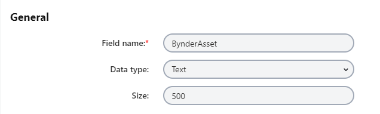
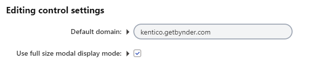

# Kentico Xperience Bynder module
[](https://stackoverflow.com/tags/kentico)

| [](https://www.nuget.org/packages/Kentico.Xperience.Bynder.KX13/0.1.1) | NuGet package for Xperience administration |
| ------------- |:-------------:|

[Kentico Xperience](https://xperience.io/) form control for selecting images from the [Bynder](https://www.bynder.com/) digital asset management platform (DAM).

This repository contains source code for the module that integrates Kentico Xperience with Bynder digital asset management platform.

## Description
This project contains a Kentico Xperience module that adds the *Bynder image selector* [form control](https://docs.xperience.io/x/iwyRBg) for Xperience administration forms. By assigning the form control to a page type field, users can select and display images stored in the Bynder service when editing pages in the Xperience Pages application.
 
## Requirements and prerequisites
* *Kentico Xperience 13* installed.
  - Both ASP.NET Core and ASP.NET MVC 5 development models are supported.
* URL and credentials to your Bynder portal.
* Basic knowledge of developing ASP .NET MVC 5 applications with Kentico Xperience.

## Installation
1. Open the solution with your administration project (*~/WebApp.sln*).
1. Navigate to the *NuGet Package Manager Console*.
1. Run *Install-Package Kentico.Xperience.Bynder.KX13 -Version 0.1.0*
1. Build the *CMSApp* project.
1. Run the Xperience administration to finish the module installation.

Kentico Bynder module with the *Bynder image selector* form control is successfully installed.

## Using the form control 
### Xperience administration
To utilize the Bynder integration when editing pages in the Xperience administration, you need to assign the *Bynder image selector* form control to a page type field:

1. Create a new field for the page type with the following properties:
   - Data type: *Text*
   - Size: *500*    
<kbd></kbd>
   - Form control: *Bynder image selector*
<kbd></kbd>

2. Configure the editing control settings (optional):
   - Default domain – The URL of your Bynder portal. If not specified here, you will be prompted to enter the URL when using the form control (e.g. in the Pages application).
   - Use full size modal display mode – Select to set the display mode of the Bynder dialog to 'Full size modal' (this is recommended). If not selected, the smaller 'In a container' dialog will be used.
<kbd></kbd>

### Live site
Adjust the code of your live site application to display the selected images from Bynder:

1. Replace the generated code of your page type's model in your live site application with the new page type code from the Code tab in the Page types application.
2. Supply the Bynder asset URL to the ViewModel:
```c#
public class BynderPreviewViewModel
{
    public string BynderAssetUrl {get; set;}

    public BynderPreviewViewModel(GeneratedPageTypeClass page)
    {
        BynderAssetUrl = !string.IsNullOrEmpty(page.Fields.BynderAsset) ? JObject.Parse(page.Fields.BynderAsset)["assetUrl"].ToString() : null
    }
}
```
3. Edit the view to show the selected image from the Bynder DAM:
```html
@model BynderPreviewViewModel
<div class="BynderAsset">
    
</div>
```

## Get involved

Check out the [contributing](CONTRIBUTING.md) page to see how to file issues, start discussions, and begin contributing.

## [Questions & Support](https://github.com/Kentico/Home/blob/master/README.md#getting-support-for-open-source-projects)

See the [Kentico home repository](https://github.com/Kentico/Home/blob/master/README.md) for more information about the product(s) and general advice on submitting your questions.
